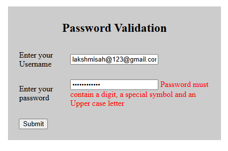

# password-validation-js

A simple password validation project using HTML, CSS and JavaScript that checks password strength based on length, uppercase letters, numbers and special characters.

## Screenshot

## Features

- Password cannot be empty
- Minimum 8 characters
- At least one uppercase letter
- At least one number
- At least one special character

## Technologies Used

- HTML5
- CSS3
- JavaScript
  
## Author
Laxmi Sah
